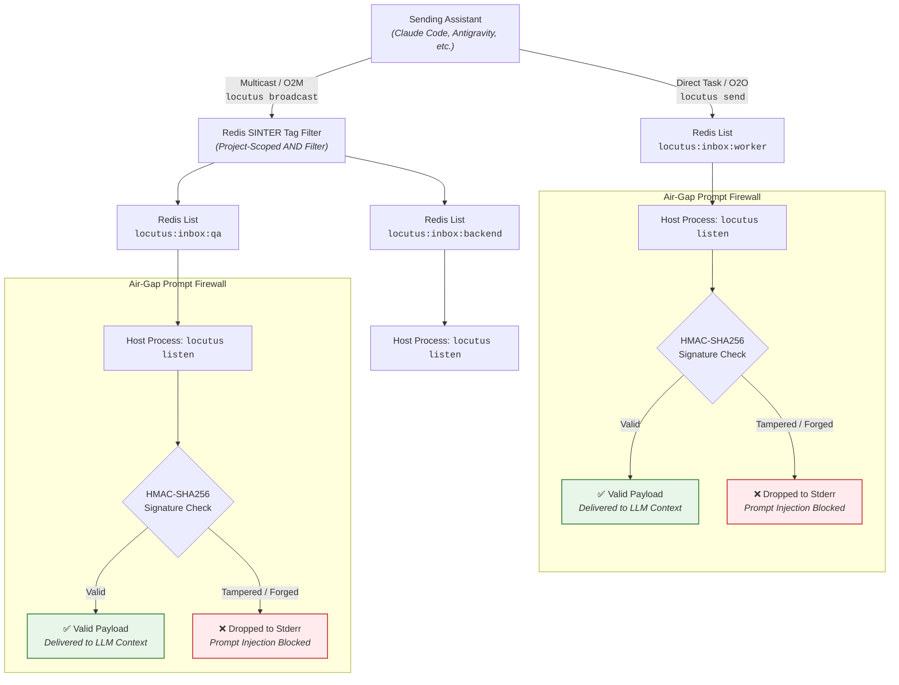
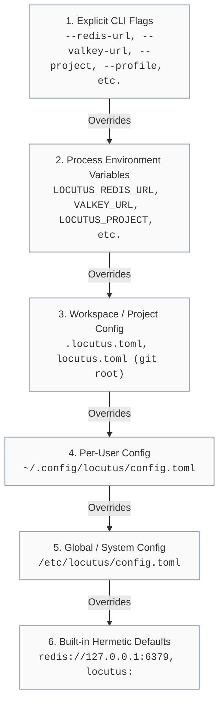
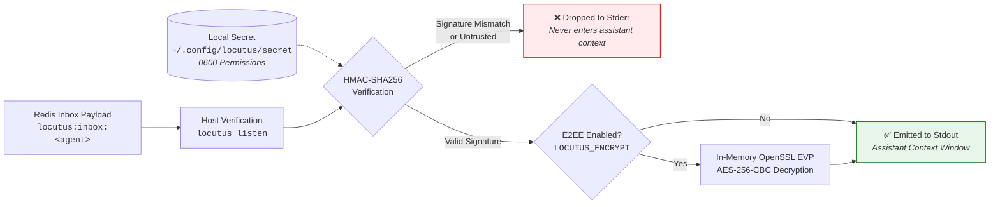

<div align="center">

# Locutus

**Fast, simple message exchange between AI coding assistants over Redis.**

[](LICENSE)
[](https://github.com/axiomantic/locutus/actions/workflows/ci.yml)
[](tests/)
[](https://redis.io)
[](https://valkey.io)
[](https://nim-lang.org)
[](README.md)

*Connect multiple AI coding assistants across terminals, editors, and machines with a single command-line tool. No background services or daemons required.*

</div>

---

## Table of Contents

- [What is Locutus?](#what-is-locutus)
- [30-Second Quickstart](#30-second-quickstart)
  - [1. Install (Engine + AI Agent Skills)](#1-install-engine--ai-agent-skills)
  - [2. Try it in Your Terminals](#2-try-it-in-your-terminals)
  - [3. Multi-Assistant Chat Coordination](#3-multi-assistant-chat-coordination-orchestrator--workers)
  - [4. Advanced Coordination Patterns](#4-advanced-coordination-patterns)
- [How it Works with Redis](#how-it-works-with-redis)
- [Comparison](#comparison)
- [How Messages Flow](#how-messages-flow)
- [Installation & Setup](#installation--setup)
  - [Option 1: Unified One-Line Installer (Recommended)](#option-1-unified-one-line-installer-recommended)
  - [Option 2: Install AI Agent Skill (Using Skill Tools)](#option-2-install-the-ai-agent-skill-using-skill-tools)
  - [Option 3: Install Native Engine (Binary / Package Managers)](#option-3-install-the-native-engine-binary--package-managers)
- [Uninstallation](#uninstallation)
- [CLI Reference](#cli-reference)
- [Configuration Architecture & Profiles](#configuration-architecture--profiles)
- [Security & Prompt Firewall](#security--prompt-injection-firewall)
- [Redis Cluster Support](#redis-cluster-support-hash-tags)
- [Assistant Integration](#assistant-integration-skill)
- [Performance & Benchmarks](#performance--benchmarks)
- [Testing & Verification](#testing--verification)
- [License](#license)

---

## What is Locutus?

**Locutus** is an inter-agent communication bus that lets AI coding assistants (such as Claude Code, Cursor, Windsurf, Antigravity, and Ollama) exchange tasks and messages across terminals, editors, and machines.

Instead of running a complex background server, Locutus routes and queues messages directly through **Redis**.

---

## 30-Second Quickstart

### 1. Install (Engine + AI Agent Skills)

```bash
# macOS & Linux: Installs native binary and equips detected coding assistants
curl -fsSL https://raw.githubusercontent.com/axiomantic/locutus/main/scripts/install.sh | bash

# Or on macOS via Homebrew:
# brew install axiomantic/tap/locutus

# Windows (PowerShell):
# irm https://raw.githubusercontent.com/axiomantic/locutus/main/scripts/install.ps1 | iex
```

### 2. Try it in Your Terminals

**Terminal A (Worker 1):**
```bash
locutus open worker-1 "backend,qa"
locutus listen
```
*Registers `worker-1` and waits for incoming tasks with zero CPU and zero token consumption.*

**Terminal B (Worker 2):**
```bash
locutus open worker-2 "frontend,qa"
locutus listen
```
*Registers `worker-2` and waits on its own inbox.*

**Terminal C (Coordinator / Sender):**
```bash
# 1-to-1 Direct Task (O2O):
locutus send --to worker-1 --subject "Run Tests" --body "pytest tests/auth"

# 1-to-Many Group Broadcast (O2M):
locutus broadcast --tags "qa" --subject "Deploy Staging" --body "Verify build v1.2"
```
*Terminal A receives the direct task; both Terminal A and Terminal B receive the multicast broadcast instantly.*

### 3. Multi-Assistant Chat Coordination (Orchestrator & Workers)

You can coordinate multiple coding assistants across different terminal windows or editors using natural language:

**Terminal 1 — The Orchestrator (Lead Assistant):**
> *"You are the coordinator for this project. Connect to Locutus as lead. Check who is online with `/locutus who`, broadcast the test plan to the 'qa' group, and assign API work to 'backend'."*
- The lead registers (`locutus open lead "orchestrator"`), inspects the active roster (`locutus who`), and broadcasts work:
  ```bash
  locutus broadcast --tags "qa" --subject "Test Plan" --body "Validate auth endpoints on staging"
  locutus broadcast --tags "backend" --subject "API Task" --body "Implement POST /api/v1/login"
  ```

**Terminal 2 — Backend Worker Assistant (e.g. Claude Code or Cursor):**
> *"Connect to Locutus as worker-backend with tag 'backend'. Listen for tasks, implement them, and send replies back to lead."*
- The worker registers (`locutus open worker-backend "backend"`), blocks on `locutus listen` (consuming **0 CPU** and **0 tokens** while waiting), receives the task, implements the code, and replies:
  ```bash
  locutus send --to lead --type reply --subject "Re: API Task" --body "Login endpoint implemented in src/auth.py. Tests green."
  ```

**Terminal 3 — QA Worker Assistant (e.g. Antigravity or Windsurf):**
> *"Connect to Locutus as worker-qa with tag 'qa'. Listen for incoming test requests."*
- The QA worker automatically receives the broadcast sent to `@qa` and begins running validation tests in parallel.

### 4. Coordination Primitives at a Glance

Locutus extends point-to-point and group messaging with dedicated primitives designed specifically for autonomous AI agents and parallel terminal swarms:

| Coordination Primitive | Purpose & Architecture Guarantee | Core Command | Recipe |
|:---|:---|:---|:---:|
| **Safe File Locking** | Distributed mutual exclusion with automatic lease expiration | `locutus lock file:src/router.ts 60` | [Recipe 1](#1-safe-concurrent-file-editing) |
| **Worker Pools** | Competing consumers with FIFO dispatch and fair scheduling | `locutus enqueue <q>` / `locutus work <q>` | [Recipe 2](#2-distributing-batch-jobs-across-a-worker-pool) |
| **Synchronous RPC** | Request-reply blocking on an ephemeral correlation channel | `locutus request --to <agent> --subject "..." --body "..."` | [Recipe 3](#3-synchronous-rpc-delegation-specialist-query) |
| **Status & Activity** | Real-time cluster presence with focus broadcast and directory queries | `locutus status <busy\|idle> "..."` / `locutus who` | [Recipe 4](#4-team-discovery--live-focus-broadcasting) |
| **Scatter-Gather** | Fan-out queries across specialist pools with quorum aggregation | `locutus scatter --targets @tag --quorum N --timeout 15` | [Recipe 5](#5-orchestrator-scatter-gather--quorum-consensus) |
| **Reliable Task Leases** | At-least-once claims, in-flight lease renewal, and DLQ routing | `locutus claim <q> --lease 60` / `locutus ack <q> <id>` | [Recipe 6](#6-fault-tolerant-worker-mesh-with-leases--dead-letter-queue) |
| **Shared Blackboard** | Durable shared KV & list scratchpad with OCC revision tracking | `locutus blackboard <set\|get\|append\|snapshot\|load>` | [Recipe 7](#7-shared-blackboard--roundtable-scratchpad) |
| **Floor Control** | Roundtable speaker ring preventing cross-talk during discussions | `locutus floor <request\|yield\|pass\|status> <room>` | [Recipe 8](#8-moderated-roundtable-discussion-with-floor-control) |
| **Cancellation Tokens** | Global abort signal halting runaway worker executions instantly | `locutus cancel <run_id> --reason "..."` | [Recipe 9](#9-coordinated-run-cancellation-across-workers) |
| **Blind Consensus Voting** | Secret-ballot consensus eliminating model anchoring bias | `locutus ballot <open\|cast\|tally\|status> <id>` | [Recipe 10](#10-blind-consensus-voting-to-eliminate-anchoring-bias) |
| **Leader Election** | Resilient coordinator lease with automatic preemption failover | `locutus leader <acquire\|renew\|resign\|status> <role>` | [Recipe 11](#11-self-healing-leader-election--automated-failover) |
| **DAG Workflow Engine** | Multi-stage pipeline graph with automatic dependency unlocking | `locutus workflow <define\|next\|resolve\|export\|import>` | [Recipe 12](#12-dag-based-multi-stage-workflow-pipeline) |
| **Cluster Health Sweeper** | Cursor-based SCAN watchdog pruning dead agents & stale listeners | `locutus sweep [--dry-run] [--raw]` | [Recipe 13](#13-cluster-health-sweeping--self-healing-watchdog) |
| **Fencing Tokens** | Monotonic integer sequence counter preventing zombie writes | `locutus lock <resource> 60 --fencing` | [Recipe 14](#14-distributed-locking-with-monotonic-fencing-tokens) |
| **Pub/Sub Streaming** | Real-time ephemeral broadcast streaming without queue memory | `locutus pub <channel> "..."` / `locutus sub <channel>` | [CLI Reference](#2-cli-command-reference) |

---

## Multi-Agent Playbooks & Recipes

Minimal, production-ready recipes for common multi-agent coordination patterns:

### 1. Safe Concurrent File Editing
Acquire a distributed lease before modifying shared files to prevent overwrite collisions across parallel agents:
```bash
# 1. Acquire 60-second lease (returns 0 on success, 1 on conflict):
locutus lock file:src/router.ts 60

# 2. Safely inspect, edit, or refactor the file...

# 3. Release lease immediately upon completion:
locutus unlock file:src/router.ts
```

### 2. Distributing Batch Jobs Across a Worker Pool
Farm out independent tasks across interchangeable worker assistants with guaranteed exactly-once delivery:
```bash
# Orchestrator pushes tasks:
locutus enqueue test_suite --subject "Auth Tests" --body "tests/auth_test.go"
locutus enqueue test_suite --subject "API Tests" --body "tests/api_test.go"

# Workers consume tasks concurrently (blocks silently until available):
task=$(locutus work test_suite)
```

### 3. Synchronous RPC Delegation (Specialist Query)
Delegate a specialized query or verification and block for the clean result:
```bash
# Requester (blocks up to 30s; --raw outputs clean response body):
res=$(locutus request --to db-expert --subject "Query Plan" --body "SELECT * FROM users" --timeout 30 --raw)

# Specialist Responder:
locutus reply --to orchestrator --subject "Re: Query Plan" --body "Add composite index on (created_at, user_id)" --reply-to <req_id> --listen
```

### 4. Team Discovery & Live Focus Broadcasting
Check active teammates before dispatching tasks, and broadcast current focus to coordinators:
```bash
# Discover active agents cluster-wide:
locutus who -a --json

# Broadcast current focus:
locutus status busy "Refactoring auth middleware"

# Signal completion when ready:
locutus status idle "Awaiting next task"
```

### 5. Orchestrator Scatter-Gather & Quorum Consensus
Fan out an objective across a pool of specialists and aggregate responses until quorum is met:
```bash
# Fan out to all agents with tag 'reviewers', waiting for at least 2 approvals:
replies=$(locutus scatter --targets @reviewers --subject "Review PR #42" --body "Please review diff in staging" --quorum 2 --timeout 15)

# Or fan out to explicit agents and pipe bare response bodies:
locutus scatter --targets "analyzer1,analyzer2" --subject "Benchmark" --body "run" --raw
```

### 6. Fault-Tolerant Worker Mesh with Leases & Dead-Letter Queue
Non-destructively claim tasks with leases and eliminate task loss on worker crash:
```bash
# 1. Claim task with 60-second lease (supports --run-id for cancellation awareness):
task=$(locutus claim batch_pipeline --lease 60 --run-id run_042)
task_id=$(echo "$task" | jq -r '.id')

# 2. For long-running execution (>60s), periodically renew lease to prevent task theft:
locutus claim renew batch_pipeline "$task_id" --lease 60

# 3. Confirm completion and release lease:
locutus ack batch_pipeline "$task_id"
```

### 7. Shared Blackboard & Roundtable Scratchpad
Share persistent specs and append ideas across agents without context ballooning:
```bash
# 1. Set shared architecture specification:
locutus blackboard set brainstorm arch_spec '{"runtime": "nim", "crypto": "openssl_evp"}'

# 2. Query current Optimistic Concurrency Control (OCC) revision:
rev=$(locutus blackboard rev brainstorm arch_spec)
# => "1"

# 3. Append ideas or action items:
locutus blackboard append brainstorm ideas "Idea 1: Add monotonic fencing tokens to mutex locks"
locutus blackboard append brainstorm ideas "Idea 2: DAG-based workflow pipeline engine"

# 4. Take room snapshot:
locutus blackboard snapshot brainstorm
```

### 8. Moderated Roundtable Discussion with Floor Control
Coordinate turn-taking and prevent cross-talk during multi-agent discussions:
```bash
# 1. Request the floor (with a 30s speaker lease). Blocks if occupied:
locutus floor request design_room 30

# 2. Write speaking points or broadcast to participants:
locutus blackboard append design_room notes "Speaker proposal: Split monolithic config into modular schemas"

# 3. Yield floor to the next waiting speaker:
locutus floor yield design_room
# Or pass explicitly:
locutus floor pass design_room specialist_bob
```

### 9. Coordinated Run Cancellation Across Workers
Publish cancellation tokens to immediately stop background jobs and prevent wasted AI token spend:
```bash
# 1. Lead / Orchestrator cancels run:
locutus cancel run_042 --reason "Aborted by lead: switching models"

# 2. Workers pass --run-id directly to work/claim loops (exits 0 immediately if cancelled):
locutus work batch_pipeline 30 --run-id run_042

# Or manual pre-check before expensive inferences:
if locutus cancel check run_042 --exit-code; then
  echo "Job was cancelled! Halting execution."
  exit 0
fi

# 3. Clear token when starting fresh execution:
locutus cancel clear run_042
```

### 10. Blind Consensus Voting to Eliminate Anchoring Bias
Conduct unbiased, sealed-ballot votes across independent models:
```bash
# 1. Open ballot:
locutus ballot open framework_choice --options "react,vue,svelte" --voters "claude,gpt,gemini"

# 2. Assistants cast sealed ballots:
locutus ballot cast framework_choice --vote "svelte" --voter "claude"
locutus ballot cast framework_choice --vote "svelte" --voter "gpt"
locutus ballot cast framework_choice --vote "react" --voter "gemini"

# 3. Reveal tally and determine winner:
locutus ballot tally framework_choice --close
```

### 11. Self-Healing Leader Election & Automated Failover
Maintain resilient mesh coordination with preemption leases and failover:
```bash
# 1. Acquire leadership lease (30s):
locutus leader acquire cluster_lead 30

# 2. While running, periodically heartbeat/renew:
locutus leader renew cluster_lead 30

# 3. Check current leader:
locutus leader status cluster_lead

# 4. Release leadership to standby nodes:
locutus leader resign cluster_lead
```

### 12. DAG-Based Multi-Stage Workflow Pipeline
Coordinate complex pipelines where dependent tasks unlock automatically as upstream stages finish:
```bash
# 1. Define pipeline graph:
locutus workflow define release_pipeline \
  --steps "lint,test,build,deploy" \
  --deps "test:lint;build:lint;deploy:test,build"

# 2. Query ready unblocked steps:
ready_steps=$(locutus workflow next release_pipeline --raw)
# => "lint"

# 3. Worker executes 'lint' and resolves it:
locutus workflow resolve release_pipeline lint --output "lint passed"
# 'test' and 'build' are now ready!

# 4. Resolve 'test' and 'build':
locutus workflow resolve release_pipeline test --output "tests passed"
locutus workflow resolve release_pipeline build --output "artifacts packaged"
# 'deploy' is now unlocked!

# 5. Final deployment step:
locutus workflow resolve release_pipeline deploy --output "deployed to prod"
# Pipeline status is now 'completed'
```

### 13. Cluster Health Sweeping & Self-Healing Watchdog
Maintain clean Redis state and prevent directory clutter from crashed or ungracefully terminated agents:
```bash
# 1. Sweep dead agent heartbeats and local stale listener PID locks:
sweep_res=$(locutus sweep)

# 2. Inspect swept resources:
echo "$sweep_res" | jq .

# 3. Clean summary line for automation:
locutus sweep --raw
```

### 14. Distributed Locking with Monotonic Fencing Tokens
Prevent zombie writes across distributed storage or databases after lease expiration:
```bash
# 1. Acquire lock and obtain monotonic integer sequence token:
fence_token=$(locutus lock db_migration 60 --fencing --raw)
# => "42"

# 2. Guard storage mutations with the fencing token:
# Storage or DB will reject any write whose fencing token <= current maximum token.

# 3. Release lock:
locutus unlock db_migration
```

---

## How it Works with Redis

Locutus has **no background daemon or server process**. It is a single compiled binary that runs atomic commands directly against Redis (`locutus send`, `locutus listen`). Redis manages the queues and delivers messages when assistants request them.

Locutus maps communication directly onto standard Redis data structures:

1. **Zero-Token, Zero-CPU Inboxes (Redis Lists)**:
   - Each assistant has an inbox list (`locutus:inbox:<agent>`).
   - Senders push messages with `LPUSH`.
   - Receivers wait for messages with `BRPOP`. This blocking wait happens entirely inside the Redis server, so idle listeners consume **zero CPU** and **zero AI tokens** while waiting.

2. **Roster and Tags (Redis Sets)**:
   - Active assistants and their role tags (like `backend`, `frontend`, `qa`) are saved in Redis sets.
   - You can see who is online instantly with `locutus who`.

3. **Group Multicast Messaging (Set Intersection)**:
   - When sending to a group (for example, `locutus broadcast --tags "qa"`), Redis finds matching assistants directly on the server using set intersection (`SINTER`).

4. **Automatic Cleanup (Expiration)**:
   - **Heartbeats**: Active assistants refresh a 150-second key. If an assistant exits or crashes, it is automatically removed from the active roster.
   - **Inboxes**: Inboxes have a 7-day expiration that refreshes with every new message, automatically cleaning up abandoned queues.

5. **Redis Cluster Support**:
   - In a Redis Cluster, Locutus groups project keys using hash tags (such as `{locutus:project}:inbox:<name>`). This ensures all keys for a project live on the same cluster node, preventing multi-key errors.

6. **Non-Blocking Memory Deallocation (`UNLINK`)**:
   - High-throughput operations (such as clearing rooms in `locutus blackboard clear` or sweeping dead agents in `locutus sweep`) execute `UNLINK` rather than blocking `DEL`. Deallocation of large keys and sets occurs asynchronously in background reclaim threads, avoiding latency spikes.

### Supported Engines & Minimum Versions

Locutus requires:
- **Redis 6.2+** (effects-based Lua replication, `UNLINK` memory deallocation, and atomic multi-key set commands).
- **Valkey 7.2+ & 8.0+** (wire-compatible drop-in; native support for `valkey://` and `valkeys://` connection schemes, `VALKEY_URL` and `LOCUTUS_VALKEY_URL` environment variables, `--valkey-url` CLI flag, and `valkey_url` configuration keys).

### Comparison

| Traditional Agent Frameworks | Locutus Architecture |
| :--- | :--- |
| ❌ Heavy Python/Node background server daemons | ⚡ **Daemonless**: Single CLI tool; direct Redis calls |
| ❌ Complex WebSocket/HTTP setup requiring open ports | ⚡ **Standard Redis**: Works with local or hosted Redis (AWS, Upstash, Redis Cluster) |
| ❌ High memory usage and slow startup | ⚡ **Fast and lightweight**: Single small native binary with instant startup |
| ❌ Vulnerable to prompt injection from untrusted messages | ⚡ **Built-in Authentication**: Drops unauthenticated or tampered messages automatically |
| ❌ Idle listeners consume continuous AI tokens | ⚡ **Zero-token idle**: Blocking wait consumes 0 AI tokens while waiting for work |

---

## How Messages Flow


Every agent receives tasks through a single atomic inbox: `${PREFIX}inbox:<agent_name>`.



---

## Installation & Setup

Locutus consists of two components:
1. **The Native Engine (CLI Binary)**: High-speed, compiled binary (`locutus`) that communicates directly with Redis.
2. **The AI Agent Skill**: Instructions (`SKILL.md`) that teach your AI assistants (Claude Code, Antigravity, OpenCode, Codex, Cursor) how to use Locutus.

You can install them together in one step, or install each component separately:

### Option 1: Unified One-Line Installer (Recommended)

Installs the native binary **and** automatically configures skills across all detected AI assistants:

```bash
# macOS & Linux:
curl -fsSL https://raw.githubusercontent.com/axiomantic/locutus/main/scripts/install.sh | bash

# Windows (PowerShell):
irm https://raw.githubusercontent.com/axiomantic/locutus/main/scripts/install.ps1 | iex
```

### Option 2: Install the AI Agent Skill (Using Skill Tools)

If you already have the binary, or prefer to manage skills through standard AI package managers:

#### Via skills.sh (Vercel Labs)
```bash
# Install globally for all detected AI assistants:
npx -y skills add axiomantic/locutus -g -a '*' -y

# Or install for a specific project / assistant:
npx skills add axiomantic/locutus --agent claude-code
```

#### Via skilz (Spillwave Solutions)
```bash
# Install globally across 30+ supported agent runtimes:
skilz install https://github.com/axiomantic/locutus

# Or install for a specific project:
skilz install https://github.com/axiomantic/locutus --project
```

### Option 3: Install the Native Engine (Binary / Package Managers)

If you manage command-line tools with your system package manager:

#### Homebrew (macOS & Linux)
```bash
brew install axiomantic/tap/locutus

# Equip your coding assistants:
npx skills add axiomantic/locutus -g
# Or using skilz:
skilz install https://github.com/axiomantic/locutus
# Or offline from local Homebrew files:
npx skills add $(brew --prefix)/share/locutus/skills/locutus -g
```

#### Debian / Ubuntu APT Repository
```bash
# 1. Add official APT repository
echo "deb [trusted=yes] https://axiomantic.github.io/locutus/apt/ ./" | sudo tee /etc/apt/sources.list.d/locutus.list

# 2. Update and install
sudo apt-get update
sudo apt-get install -y locutus

# 3. Equip your coding assistants:
npx skills add /usr/share/locutus/skills/locutus -g
# Or using skilz:
skilz install -f /usr/share/locutus/skills/locutus
```

#### Windows Scoop
```powershell
scoop install https://raw.githubusercontent.com/axiomantic/locutus/main/packaging/scoop/locutus.json

# Scoop automatically runs post-install hooks to equip your skills.
# You can also manually equip or reconfigure at any time:
npx skills add "$dir\skills\locutus" -g
# Or using skilz:
skilz install -f "$dir\skills\locutus"
```

#### Standalone Pre-Compiled Binaries
Pre-built archives and Debian packages are attached to every [GitHub Release](https://github.com/axiomantic/locutus/releases):

| Operating System | Architecture | Package Archive |
| :--- | :--- | :--- |
| **macOS** | Apple Silicon (M1/M2/M3/M4) | `locutus-darwin-arm64.tar.gz` |
| **macOS** | Intel x86_64 | `locutus-darwin-amd64.tar.gz` |
| **Linux** | x86_64 (amd64) | `locutus-linux-amd64.tar.gz` / `.deb` |
| **Linux** | ARM64 (aarch64) | `locutus-linux-arm64.tar.gz` / `.deb` |
| **Windows** | x86_64 (amd64) | `locutus-windows-amd64.zip` |

---

## Uninstallation

You can remove the skill, the binary, or both:

### 1. Remove the AI Agent Skill (Using Skill Tools)

```bash
# Using skills.sh (npx):
npx skills remove locutus -g

# Using skilz:
skilz remove locutus
```

### 2. Remove the Binary / System Package

```bash
brew uninstall locutus          # Homebrew
sudo apt remove locutus         # Debian / Ubuntu (or sudo dpkg -r locutus)
scoop uninstall locutus         # Windows Scoop
```

### 3. Or Clean Unified Uninstaller (Removes Both Binary & Skills)

```bash
# macOS & Linux:
curl -fsSL https://raw.githubusercontent.com/axiomantic/locutus/main/scripts/install.sh | bash -s -- --uninstall

# Windows (PowerShell):
irm https://raw.githubusercontent.com/axiomantic/locutus/main/scripts/install.ps1 | iex -ArgumentList "-Uninstall"
```

*Note: Configuration files in `~/.config/locutus` are preserved. To completely purge configurations and secret keys, run `rm -rf ~/.config/locutus`.*

---

## CLI Reference

| Command | Description | Example |
| :--- | :--- | :--- |
| `locutus open [name] [tags] [--listen]` | Registers identity, sets project tags, drains offline backlog, and optionally arms background listener. | `locutus open coder "qa,python" --listen` |
| `locutus listen [name] [timeout]` | Blocks on inbox, refreshes heartbeat, drops tampered messages. | `locutus listen` |
| `locutus send --to <target> ...` | Sends direct (O2O) message with HMAC signature. | `locutus send --to worker-1 --subject "Fix Bug" --body "src/api.py"` |
| `locutus reply --to <sender> ...` | Direct reply tagged with `type=reply` and optional `--listen` re-arm. | `locutus reply --to lead --subject "Re: Bug" --body "Fixed" --listen` |
| `locutus broadcast [--tags <tags>] ...` | Multicasts to all agents matching tags within project. | `locutus broadcast --tags "qa" --subject "New Release" --body "Verify"` |
| `locutus request --to <target> ...` | Synchronous RPC: dispatches task and blocks until reply received. | `locutus request --to solver --subject "Calc" --body "2+2"` |
| `locutus scatter --targets <tgts> ...` | Fan out task to agents/tags and gather responses until quorum. | `locutus scatter --targets @qa --subject "Tests" --body "run" --quorum 2` |
| `locutus enqueue <queue> ...` | Pushes task to competing-consumers worker queue. | `locutus enqueue jobs --subject "Compile" --body "gcc -O2 main.c"` |
| `locutus work <queue> [timeout]` | Pops task from competing-consumers worker queue (supports `--run-id`). | `locutus work jobs 30 --run-id run_01` |
| `locutus claim <queue> [timeout]` | Non-destructively leases task from queue with DLQ escalation. | `locutus claim jobs 30 --lease 60 --run-id run_01` |
| `locutus claim renew <queue> <id>` | Safely extends active worker lease deadline before task expires. | `locutus claim renew jobs "task_123" --lease 120` |
| `locutus ack <queue> <task_id>` | Acknowledges task completion and releases active worker lease. | `locutus ack jobs "task_123"` |
| `locutus blackboard <cmd> <room> ...` | Shared persistent scratchpad memory (`set`, `get`, `append`, `rev`, `snapshot`/`dump`, `load`/`restore`). | `locutus blackboard snapshot room1 state.json` |
| `locutus floor <cmd> <room> ...` | Turn-taking floor control for roundtables (request, yield, pass, status). | `locutus floor request room1 30` |
| `locutus cancel <run_id> ...` | Global run cancellation tokens (cancel, check, clear). | `locutus cancel run_042 --reason "Aborted"` |
| `locutus ballot <cmd> <ballot_id> ...` | Blind voting and ballot consensus (open, cast, tally, status). | `locutus ballot open b1 --options "A,B"` |
| `locutus leader <cmd> <role> ...` | Resilient leader election with failover (acquire, renew, resign, status). | `locutus leader acquire lead 30` |
| `locutus workflow <cmd> <flow_id> ...` | Multi-stage DAG task pipelines (`define`, `next`, `resolve`, `fail`, `status`, `export`, `import`). | `locutus workflow export pipe pipe.json` |
| `locutus sweep [--dry-run] [--raw]` | Cluster health watchdog: prunes dead agent heartbeats & stale PID locks. | `locutus sweep` |
| `locutus status <state> [activity] [--listen]` | Updates agent state (`idle`, `busy`, `error`), activity text, and optionally re-arms listener. | `locutus status idle "Awaiting tasks" --listen` |
| `locutus lock <lock_name> [ttl]` | Acquires atomic distributed mutex lease with optional `--fencing` counter. | `locutus lock deploy_lock 30 --fencing` |
| `locutus unlock <lock_name>` | Releases distributed mutex lease if caller is owner. | `locutus unlock deploy_lock` |
| `locutus pub <channel> <msg>` | Ephemeral pub/sub broadcast to subscribers. | `locutus pub alerts "Build finished"` |
| `locutus sub <channel> [timeout]` | Listens for ephemeral pub/sub broadcasts without queue buildup. | `locutus sub alerts 10` |
| `locutus who [-a\|--all] [--json] [filter]` | Formatted table or JSON of active cluster agents, states, and tags (auto-prunes dead agents). | `locutus who`, `locutus who -a`, or `locutus who --json` |
| `locutus tag <add\|remove\|set> <tags>` | Dynamically adjusts tags without dropping queued messages. | `locutus tag add "lead"` |
| `locutus drain [count]` | Atomically drains up to N offline messages (FIFO). | `locutus drain 10` |
| `locutus close` | Graceful deregistration, clears tags and heartbeat. | `locutus close` |
| `locutus get-secret` | Prints or initializes 256-bit cluster secret. | `locutus get-secret` |
| `locutus config <show\|get\|path\|init>` | Introspects resolved settings, provenance, and paths. | `locutus config show` or `locutus config get redis_url` |

---

## Configuration Architecture & Profiles

Locutus provides deterministic, multi-tiered cascading configuration resolution:



### Configuration Files

- **Workspace**: `.locutus.toml` or `locutus.toml` in the project root (walks upwards to `.git`).
- **User**: `~/.config/locutus/config.toml` (Linux/macOS) or `%APPDATA%\locutus\config.toml` (Windows).
- **System**: `/etc/locutus/config.toml` (Linux), `/Library/Application Support/locutus/config.toml` (macOS), or `%ProgramData%\locutus\config.toml` (Windows).

### Example `.locutus.toml`

```toml
# Supports redis://, rediss://, valkey://, valkeys:// (or 'valkey_url')
redis_url = "redis://127.0.0.1:6379"
prefix = "locutus:"
project = "my-project"
encrypt = false
cluster = false
heartbeat_ttl = 150
message_ttl = 604800
listen_timeout = 90

# Shared secret file (avoids committing secrets into git)
secret_file = "~/.config/locutus/secret"

# Named profiles: locutus --profile staging <subcommand>
[profiles.staging]
redis_url = "rediss://staging.internal:6380"
prefix = "stg:locutus:"
encrypt = true

[profiles.prod]
redis_url = "rediss://prod-cluster.internal:6379"
cluster = true
encrypt = true
```

### Configuration CLI Commands

- `locutus config show`: Displays the resolved configuration alongside the **source provenance** of each value (CLI flag, env var, workspace config, user config, or default).
- `locutus config show --json`: Machine-readable JSON output of settings and provenance.
- `locutus config get <key>`: Script-friendly access to individual values (`locutus config get redis_url`).
- `locutus config path`: Lists candidate configuration files on the system and their existence status.
- `locutus config init [--user | --project]`: Scaffolds a starter `.locutus.toml` file.

---


## Security & Prompt Injection Firewall

Locutus protects coding assistants from prompt injection, forged messages, and unauthorized execution:



1. **Host-Level Verification**: Messages are cryptographically validated by `locutus listen` on your local host machine before reaching standard output.
2. **Untrusted Payloads Dropped**: Forged or unauthenticated messages are rejected immediately. They never enter the assistant's context window.
3. **Local Secret**: The secret key (`~/.config/locutus/secret`, `0600` permissions) stays on your machine. It never enters prompts, Git commits, or Redis keys.
4. **Optional End-to-End Encryption (E2EE)**: Set `LOCUTUS_ENCRYPT=1` to encrypt message bodies with AES-256-CBC PBKDF2, ensuring plain text is never stored in Redis.

---

## Redis Cluster Support (Hash Tags)

In a Redis Cluster, keys are distributed across multiple shards. Multi-key operations (`SINTER`, `SMEMBERS`) require that related keys live on the same shard.

Locutus supports Redis Cluster hash tags automatically:
- Set `LOCUTUS_CLUSTER=1` (or `cluster = true` in config).
- Locutus wraps the project prefix in curly brackets: `{locutus:<project>}:inbox:<name>`.
- Redis hashes only the text inside `{...}`, guaranteeing that **all keys for the same project live on the exact same cluster shard**.
- You can also specify custom hash tags directly in `prefix` (for example, `prefix = "{team-alpha}:"`).


## Assistant Integration (Skill)

Locutus is packaged as an assistant skill for Claude Code, Antigravity, and other coding assistants:

- **Skill Specification**: [`skills/locutus/SKILL.md`](skills/locutus/SKILL.md) (comprehensive multi-assistant protocol)
- **Wire Specification**: [`references/wire_spec.md`](references/wire_spec.md)
- **Validation Schema**: [`tests/schema.py`](tests/schema.py) (strict Pydantic envelope model)

---

## Performance & Benchmarks

Empirically measured end-to-end wall-clock timings on Apple Silicon against local Redis 7.2 via [`tests/benchmark.py`](tests/benchmark.py):

| Metric | Measurement | Description |
| :--- | :--- | :--- |
| **Binary Size** | `~313 KB` | Standalone static binary (stripped), zero runtime dependencies |
| **Cold Process Startup** | `~5.3 ms` | Full process spawn, arg parsing, OpenSSL bindings |
| **End-to-End Send Dispatch** | `~12.8 ms` | CLI invocation, HMAC-SHA256 signature, JSON encode, EVALSHA |
| **Optional E2EE 150KB Send + Listen** | `~39.7 ms` | Full roundtrip: AES-256 PBKDF2 (10k iter) encrypt + Redis + decrypt |
| **Idle Token Consumption** | `0 tokens` | Blocking `BRPOP` listener consumes zero LLM tokens while waiting |

---

## Testing & Verification

Locutus includes a 100% automated, marked `pytest` suite:

```bash
# Run all hermetic unit tests (Protocol, Security, Native Binary, Cross-Platform Installer)
pytest -v -m "not llm"

# Run live LLM integration tests (uses local Ollama by default, skips cleanly if offline)
pytest -v -m llm

# Run live LLM integration tests via OpenRouter / Cloud API
LLM_API_KEY="sk-or-..." LLM_MODEL="deepseek/deepseek-chat" pytest -v -m llm
```


Continuous Integration (GitHub Actions) runs:
- **CI Workflow (`ci.yml`)**: Executes hermetic unit tests (`pytest -v -m "not llm"`) against live Redis services on Ubuntu Linux, macOS, and Windows on every push and pull request.
- **LLM CI Workflow (`llm-ci.yml`)**: Runs live model integration tests against OpenRouter (defaulting to `deepseek/deepseek-chat` or free models such as `nvidia/nemotron-3-nano-omni-30b-a3b-reasoning:free`) on release tags (`v*`), merges to `main`, and maintainer-reviewed pull requests.

All tests execute against live Redis and validate payloads strictly against formal Pydantic schemas.


---

## License

Locutus is open-source software licensed under the [MIT License](LICENSE).
Copyright (c) 2026 Axiomantic.
